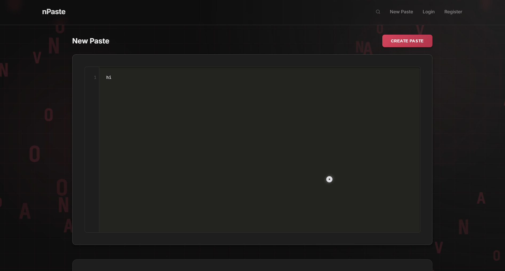
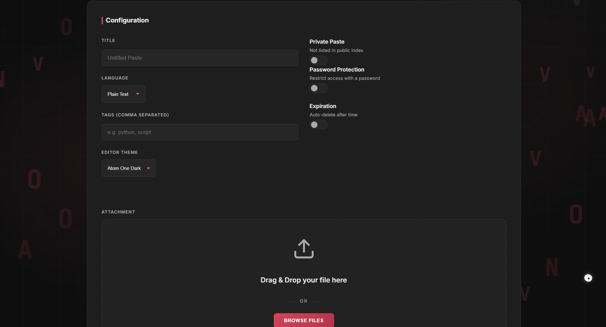
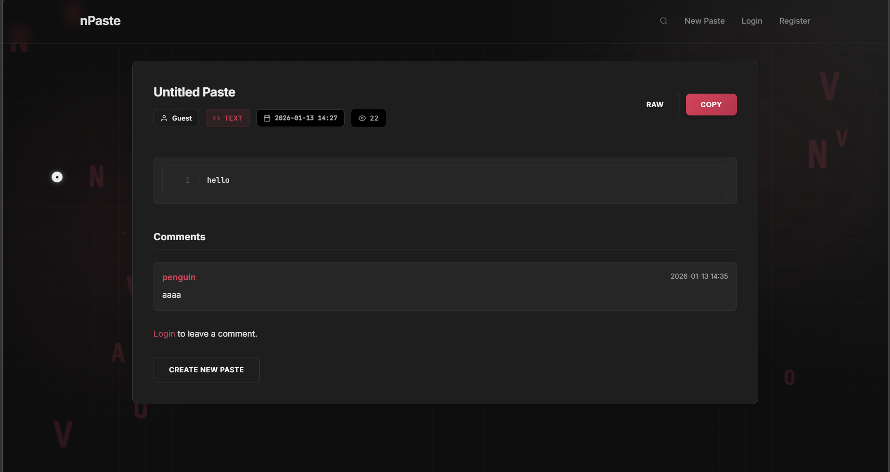
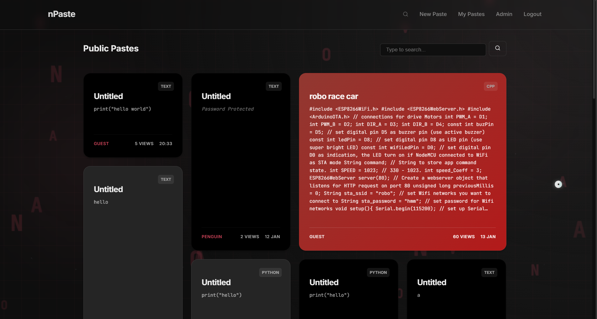
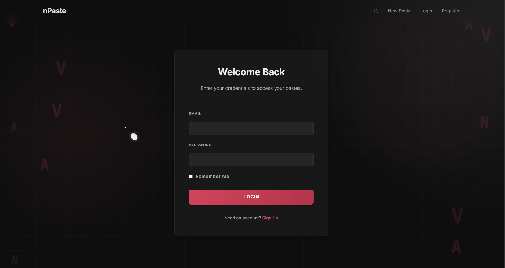
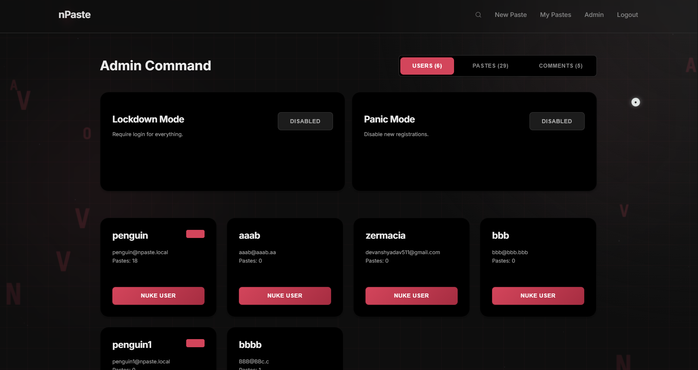

# nPaste

nPaste is a flask based pastebin alternative for nCrypt with user accounts, private/public pastes, password-protected pastes, tagging, comments, file attachments, lockdown modes, public paste lookup, and an api.

## features

- create, edit, view, and delete pastes
- public and private pastes
- paste password protection
- expiration (10m, 1h, 1d, 1w, 1m, never)
- tags and search (web +api)
- syntax highlighted paste view
- attachments saved under app/static/uploads
- user auth 
- admin dashboard with lockdown and panic toggles to 
	- toggle new account registration
	- require account for actions
- api endpoints for create/get/search
- cli for creating and searching pastes
- uvicorn (serving flask via WSGI middleware)

## screenshots

### home





### paste view



### browse



### login



### admin




## getting started

### install deps

```bash
pip install -r requirements.txt
```

### configure env vars

copy the sample file and update values:

```bash
cp .env.example .env
```

### runnnnnnn

```bash
python run.py
```

default endpoint:

- http://127.0.0.1:5000

## env vars

defined in .env.example:

- SECRET_KEY: Flask secret key
- UPLOAD_FOLDER: upload directory (relative or absolute)
- MAX_CONTENT_LENGTH: max upload size in bytes
- ADMIN_USERNAME: admin username to create/use
- ADMIN_EMAIL: admin login email
- ADMIN_PASSWORD: admin login password

## api

Base path: /api

### create paste

POST /api/paste

example body:

```json
{
  "title": "example",
  "content": "print('hello')",
  "language": "python",
  "tags": "python, hi",
  "private": false,
  "expiry": "1h"
}
```

### get specific paste

GET /api/p/<custom_id>

### search pastes

GET /api/search?q=<query>&tag=<tag>

## cli usage

create paste from stdin:

```powershell
echo "print('hello')" | python npaste_cli.py create --lang python --title demo
```

search:

```powershell
python npaste_cli.py search "demo"
```

by default, BASE_URL inside npaste_cli.py points to http://127.0.0.1:5000.

## misc

- SQLite db at site.db.
- tables are created automatically at startup via db.create_all().
